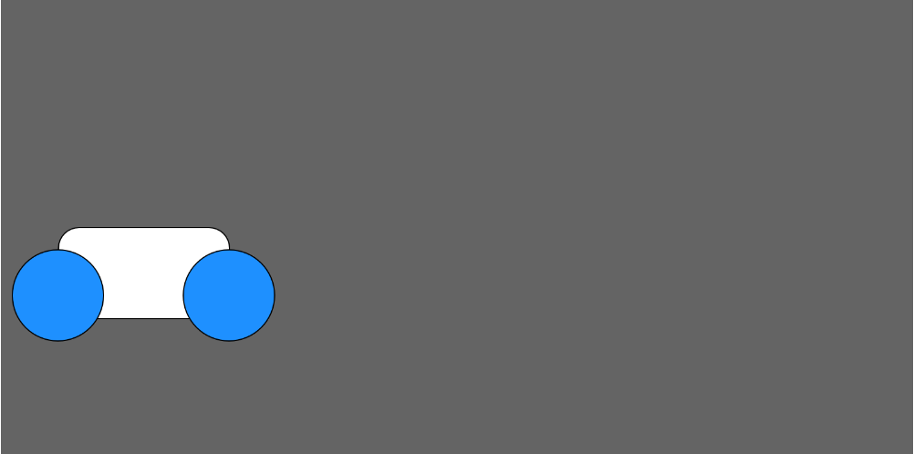

# Build and Animate a Tron Bike!

## Objectives

## Instructions
**1.** Make the tron bike on a grey canvas with dimensions 800x400. The wheels should be ellipses with dimensions 80x80, and the body of the bike should be a rectangle with dimensions 150x80. You will need to figure out how to round the corners using an additional argument. 

**2.** Make the tron bike start in the bottom left and move across the screen from left to right. 

**3.** Make the tron bike move back and forth across the screen (bouncing off the edges of the canvas)

**4.**
## Bonus

